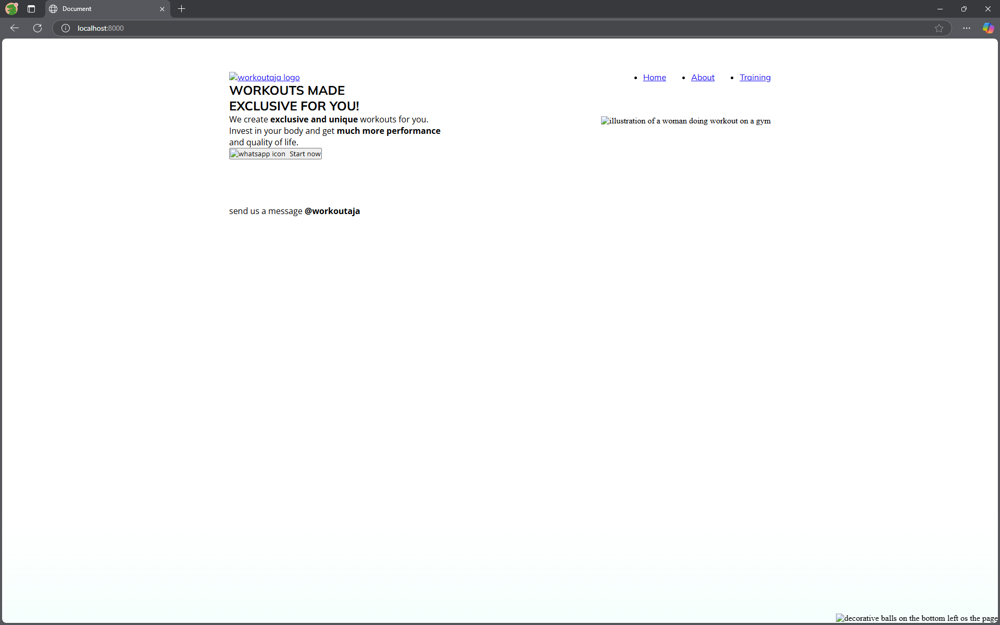
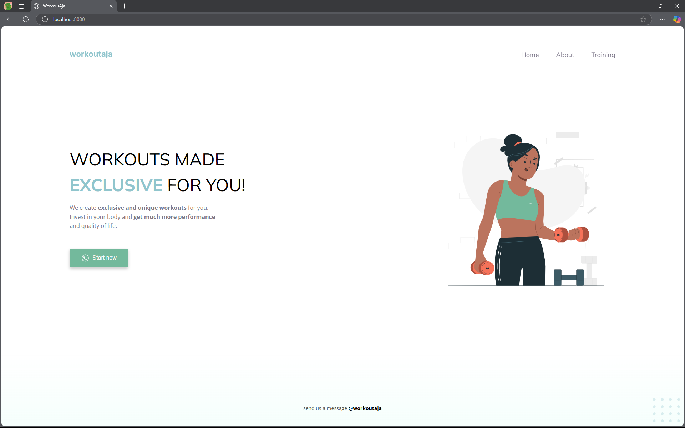

# WorkoutAja Website Improvements Report

## Overview
This report documents the changes and improvements made from the original "workoutaja" implementation to the enhanced "workoutaja_fix" version. All improvements were implemented based on the Figma design at [https://www.figma.com/design/CAawvDkcG4AIoMWvHwrQvo/workoutaja](https://www.figma.com/design/CAawvDkcG4AIoMWvHwrQvo/workoutaja).

## Changes and Improvements

### File Structure
- Added `script.js` for interactive functionality
- Corrected image paths from `/imgs/` to `/images/` directory

### HTML Improvements
- Updated page title from "Document" to "WorkoutAja"
- Added proper class names for the main image (`class="main-image"`)
- Improved button accessibility by adding ID (`id="start-btn"`)
- Enhanced content formatting and copy text
- Implemented proper script inclusion at the end of the body
- Removed duplicate `href` attribute in the logo link
- Improved overall HTML structure and indentation

### CSS Enhancements
- Added `box-sizing: border-box` for better element sizing
- Implemented responsive design with media queries
- Added page transition effects with fade-in animations
- Enhanced navigation with hover effects and underline animations
- Improved button styling with proper color, shadow, and hover effects
- Added proper font family declarations throughout the site
- Implemented flexible layouts with proper use of flex properties
- Fixed element positioning and spacing
- Improved color scheme consistency
- Added visual feedback for interactive elements

### JavaScript Functionality (New)
- Implemented page load animations
- Added button click effects and state management
- Created navigation link active states
- Enhanced user experience with smooth transitions
- Added event listeners for interactive elements

### Visual Improvements
- Better spacing and layout throughout the site
- Improved readability with proper text sizing and line heights
- Enhanced mobile responsiveness
- More consistent branding and styling

## Before and After Comparison

